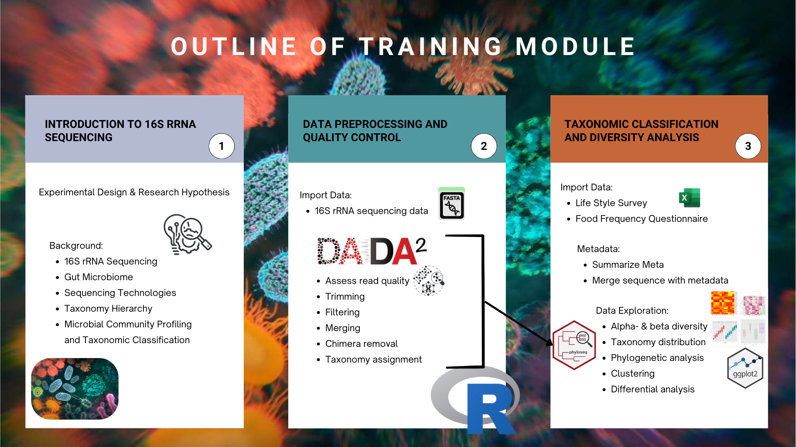
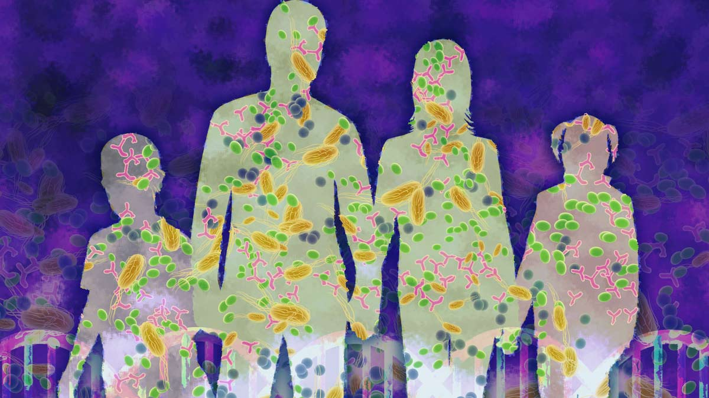
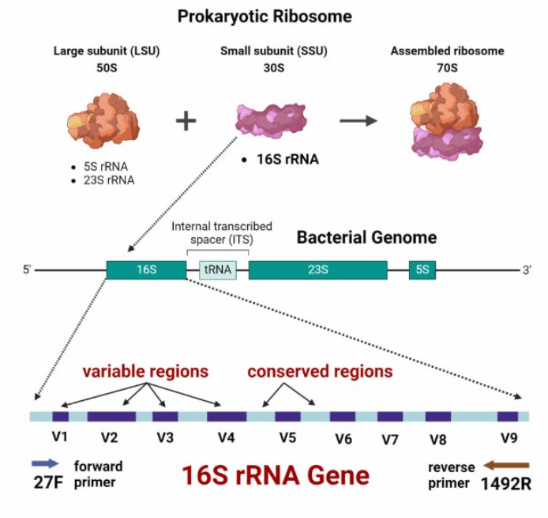
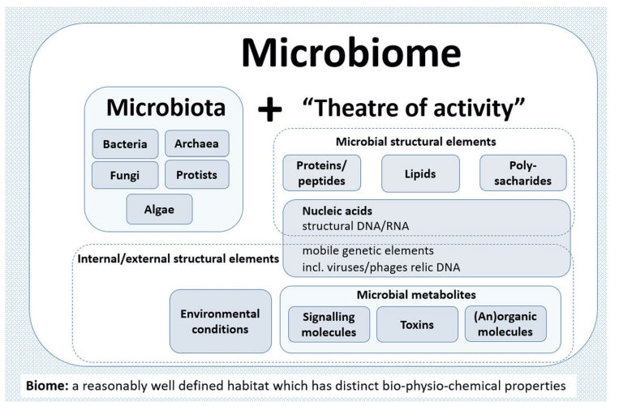
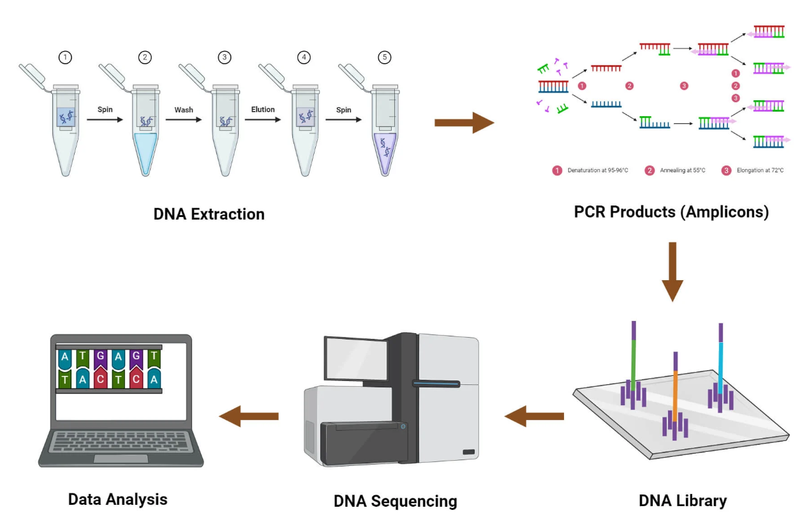
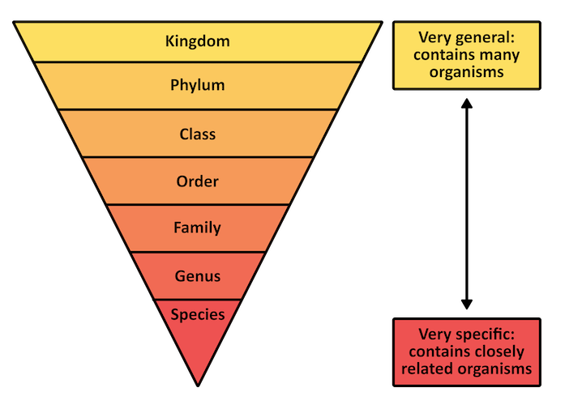

```{r setup, include=FALSE}
knitr::opts_chunk$set(echo = TRUE)
```

# Submodule 01: Introduction to 16S rRNA Sequencing and Microbial Community Analysis

<center>
    
</center>

## Overview
This module introduces participants to the principles of 16S rRNA sequencing and its applications in microbial community analysis. 16S rRNA gene sequencing is a commonly used method to study the diversity and composition of microbial communities by focusing on a specific region of the ribosomal RNA gene that is present in all bacteria<sup>1</sup>. Understanding how to process and analyze this data is critical in studies related to the human gut microbiome, among others. We will review key concepts such as taxonomic classification, microbial profiling, and sequencing technologies.

## Learning Objectives 
+ Learning Objective 1: Understand the basic principles of 16S rRNA sequencing
+ Learning Objective 2: Gain insights into microbial community profiling and its applications

# Background 
<center>
    
</center>
<!-- image refernce: https://www.genome.gov/about-nhgri/Director/genomics-landscape/june-6-2019-Human-Microbiome_Project-->

## 1. 16S rRNA Sequencing
We will be analyzing microbiota community composition using 16s sequencing. 16S is the ribosomal RNA (rRNA) found in prokaryotes, distinct from eukaryotic ribosomal RNA, thus an efficient filter for prokaryotes from our samples<sup>2</sup>. The 16S gene, found in the small subunit of the prokaryotic ribosomes, has many highly conserved areas across species<sup>3</sup>, enabling the creation of primers that bind and amplify almost all bacterial species<sup>1</sup>. Additionally, this gene has areas of highly variable sequences, allowing us to differentiate which species we have. 16S rRNA analysis determines the diversity and relative abundance of microbes in a sample. We can then associate differences in diet and lifestyle with microbiome community structure.

<center>
    
</center>

<!-- image refernce: https://microbenotes.com/16s-rrna-gene-sequencing/-->

The 16S rRNA gene is widespread, has a relatively slow mutation rate in conserved regions, and high variability in other parts of the sequence, which makes it suitable for taxonomic identification. Researchers can sequence the 16S rRNA gene from mixed microbial samples, such as those from soil<sup>4</sup>, water<sup>5</sup>, or different areas of humans, such as the skin, oral cavity, vagina, or the gut<sup>6</sup>, to identify and quantify the microbes present without the need to culture them in a lab. This gene provides a snapshot of the microbial diversity within a sample, enabling researchers to explore how microbial communities influence human health, environmental processes, and other biological systems. This method has been widely used to investigate the gut microbiome’s relationship with dietary patterns, lifestyle, and various diseases.

## 2. Gut Microbiome

The gut microbiome refers to the dynamic ecosystem of microorganisms living in the digestive tracts of humans and other animals with distinct bio-physio-chemical properties<sup>7</sup>. These microbes are impacted by their host through various factors, such as diet<sup>8</sup> and environmental factors<sup>9</sup>, and in turn, impact their host<sup>10</sup> by transforming and metabolizing undigested dietary components -mostly fibers and complex carbohydrates- in our food into short-chain fatty acids and other metabolites required for intestinal homeostasis<sup>11</sup>.

### Microbiota: The "Who" in the microbiome.

The microbiota refers to the community of microorganisms making up the microbiome. This includes:
 - *Bacteria*
 - *Archaea*
 - *Fungi*
 - *Protists*
 - *Algae*

### Microbiome: What the microbes actually do.

Microorganisms can impact their environment (or the host) in various ways. When considering the complexity of the microbiome, it’s important to remember that the microbiome refers to more than the collection of all the microorganisms that are present (microbiota). The gut microbiome refers to the microbiota and all the properties of the gut ecosystem, such as the pH, redox potential, and metabolites within the ecosystem. The additional properties are referred to as the "theater of activity", through which the microbiome interacts dynamically within itself and with the environment (in this case--you).
These microbes play essential roles in digestion, nutrient absorption, immune system function, and even mental health<sup>10,12</sup>. An imbalance in the composition and function of the gut microbiome, known as dysbiosis, has been linked to a range of health conditions, including inflammatory bowel disease<sup>13</sup>, obesity<sup>14</sup>, diabetes<sup>15</sup>, and even mental health disorders like depression<sup>16</sup>.

<center>
    
</center>
<!-- image refernce: Freese lab slides-->

## 3. Sequencing Technologies for 16S rRNA

Several sequencing technologies are available for studying microbial communities, the most commonly used platforms include **Illumina, PacBio, and Oxford Nanopore Technologies.** These platforms offer high-throughput capabilities that allow researchers to sequence hundreds to thousands of microbial DNA samples simultaneously.

Illumina sequencing is the most widely used technology for 16S rRNA sequencing. It provides short paired-end reads (150–300 bp) and is highly accurate, making it ideal for targeting specific regions of the 16S rRNA gene<sup>17</sup>. The platform is cost-effective and allows for the generation of large amounts of data in a short time.

+ **Drawback:** Illumina typically only sequences 1 to 2 portions of the variable regions of the 16S gene (V4 or V3-V4), rather than the full-length gene, which can limit resolution at lower taxonomic levels.

PacBio and Oxford Nanopore Technologies offer longer read lengths and allow for full-length 16S rRNA gene sequencing. This can increase the resolution of taxonomic identification and provide more comprehensive data on microbial diversity<sup>18</sup>.

+ **Drawback:** These platforms are generally more expensive and can have higher error rates than Illumina sequencing, though error correction methods have improved this.

The 16S rRNA gene sequencing process involves:

+ DNA extraction from microbial communities in the sample.
+ Amplification of the 16S rRNA gene using polymerase chain reaction (PCR) with primers targeting conserved regions of the gene.
+ Library preparation with adding adaptors. 
+ Sequencing of the amplified gene region.
+ Bioinformatics analysis to process the sequence data, identify microbial taxa, and quantify their relative abundances.


<center>
    
</center>
<!-- image refernce:https://microbenotes.com/amplicon-sequencing/-->


## 4. Taxonomy Hierarchy

Taxonomy is the science of classifying organisms based on shared characteristics. In microbiome studies, taxonomy helps us organize microorganisms (like bacteria) into different classification levels, allowing us to group similar organisms and identify specific types of bacteria within a sample.

The **taxonomy hierarchy** follows a standardized structure that classifies organisms from broad groupings to more specific ones. The main levels of taxonomy used in microbiome studies are:

 - **Kingdom:** At the highest level in 16S rRNA studies, we are mainly interested in the Bacteria kingdom, but other domains like Archaea can also be included.
 - **Phylum:** Groups of related classes; for example, the phylum Firmicutes includes many bacteria commonly found in the human gut.
 - **Class:** A division within phyla; for example, the class Clostridia falls under Firmicutes.
 - **Order:** A further subdivision, grouping similar families.
 - **Family:** Groups of closely related genera. For example, Lactobacillaceae is a family within the order Lactobacillales.
 - **Genus:** A group of species with shared characteristics; for example, Lactobacillus is a genus within the family Lactobacillaceae.
 - **Species:** The most specific level, identifying individual types of bacteria. For example, Lactobacillus acidophilus is a species within the genus Lactobacillus.

In microbiome analysis, each level gives us a different resolution of the microbial community, from broad to specific<sup>19</sup>. The deeper we go in the hierarchy, the more specific the classification becomes, allowing us to identify bacteria at finer levels. Common levels of taxonomic hierarchy used in reaserch include: Phylum, Family, Genus, and Species.

### How does 16S rRNA sequencing use the taxonomy hierarchy?

When we perform 16S rRNA sequencing, we can analyze our data at different levels of this taxonomy hierarchy, depending on our research questions and the primers we select.

1. **Higher levels (Phylum, Class, Order):**

    - These levels provide a broad overview of the bacterial community and help us see general patterns, like shifts in major bacterial groups due to diet, disease, or environment.
    - Useful for general comparisons, such as comparing the overall diversity between different environments or conditions (e.g., comparing the gut microbiome composition at the phylum level between healthy and diseased individuals).
    - It is often more reliable, as there are fewer ambiguities in classifying bacteria at these broad levels.

2. **Lower levels (Family, Genus, Species):**

    - These levels give us more specific information about the type of bacteria present and are more informative for correlating specific bacteria to health outcomes or identifying particular bacterial strains that may be beneficial or harmful.
    - Useful for targeted studies, such as identifying specific genera or species associated with particular health conditions or environmental changes.
    - Just looking at the species level may overcomplicate the data making differences between populations difficult to detect. 
    - However, 16S sequencing often struggles to resolve species-level distinctions, especially if two species have very similar 16S rRNA sequences. In these cases, we may only be able to confidently identify bacteria down to the genus level.

In practice, researchers often examine multiple levels to get a comprehensive picture. For example, we might examine broad patterns at the phylum level, then zoom in to the genus level to identify specific bacteria of interest.


<center>
    
</center>
<!-- image refernce:https://www.mometrix.com/academy/biological-classification-systems/-->


## 5. Microbial Community Profiling and Taxonomic Classification

Microbial community profiling refers to identifying the composition and structure of microbial populations within a given environment. Through 16S rRNA sequencing, researchers can generate a comprehensive profile of the different bacterial species present in a sample and their relative abundances<sup>1</sup>. This profiling helps to characterize complex microbial ecosystems, such as the human gut, which contains thousands of bacterial species that play crucial roles in health and disease.

Key steps in microbial community profiling include:

1. **Data preprocessing:** Quality filtering, trimming, and chimera checking of sequences to remove low-quality reads and errors.
2. **Operational Taxonomic Unit (OTU) or Amplicon Sequence Variant (ASV) assignment:** Grouping sequences based on similarity to form clusters that represent distinct microbial taxa. Traditionally, sequences are grouped into OTUs based on a similarity threshold (e.g., 97%), but newer methods like DADA2 generate ASVs, which provide higher resolution by differentiating sequences down to single-nucleotide differences.
3. **Taxonomic classification:** Assigning taxonomy to OTUs or ASVs based on comparison with reference databases such as SILVA, Greengenes, or RDP (Ribosomal Database Project). This allows researchers to classify the microbes at various taxonomic levels, including phylum, genus, and species.
4. **Diversity analysis:** Understanding the diversity within a sample (alpha diversity) and between samples (beta diversity). Alpha diversity measures such as Shannon diversity matrix<sup>20</sup> or Pielou’s evenness index<sup>21</sup> provide insights into species richness and evenness. Beta diversity metrics like Bray-Curtis dissimilarity<sup>22</sup> for evenness and  Jaccard distance<sup>23</sup> for richness are used to compare microbial communities between different samples and often conditions. Another beta diversity metric commonly used is the weighted UniFrac, which considers phylogeny (how closely related organisms are genetically) as a factor when assigning distance<sup>24</sup>.

The outcome of taxonomic classification and microbial community profiling provides a detailed map of the microbial landscape in a sample, enabling researchers to explore relationships between microbial communities and external factors, such as diet, lifestyle, and health outcomes. This analysis is crucial for understanding how changes in microbial populations correlate with various physiological states or environmental conditions.

## 6. Study Design and Hypothesis Development
<center>
    
</center>

In this training module, we will be analyzing gut microbiome data from a University of Nevada, Reno study. The **WOLFPACK Study** (Wide Open Local Fecal sample collection comparing Pharmaceutical intake, ACtivity, and dietary intaKe) is designed to explore how diet, health, and many lifestyle aspects impact the gut microbiome of adults living in Northern Nevada. By examining the bacterial composition of fecal samples using 16S rRNA sequencing, and linking these findings to lifestyle and dietary information collected through surveys, this study aims to provide insights into how daily habits and health status influence gut ecology.

The study design involves collecting data through three main sources:

 - **Lifestyle Questionnaire:** This is a lengthy survey capturing information on participants' habits, including physical activity, home environment, social connectedness, socioeconomic status, and health history.
 - **[Food Frequency Questionnaire:](https://epi.grants.cancer.gov/diet/usualintakes/ffq.html)** This is a robust survey that assesses a variety of dietary patterns, asking about consumption frequency of many foods.
 - **16S rRNA Sequencing:** Participants also provided a fecal sample, which was processed and sequenced.


### Hypothesis and Research Questions
This study aims to explore the overarching question:

**How do diet and lifestyle influence the composition and diversity of the gut microbiome in Northern Nevadans?**

Based on this question, we can formulate several hypotheses and sub-questions to guide our analysis. 

 1. **Hypothesis 1:** Dietary patterns significantly impact the diversity and composition of the gut microbiome.
    - **Question:** How does the frequency of consuming protein correlate with the abundance of bacteria, such as those in the *Firmicutes* phylum which are associated with obesity?
    - **Question:** Are there specific dietary patterns (e.g., high-protein) associated with distinct gut microbiome profiles?
      


 2. **Hypothesis 2:** Gut microbiome composition is shaped by external factors like sex and body mass index (BMI).
    - **Question:** Is there a correlation between lower BMI and greater microbiome diversity?
    - **Question:** Are there district differences between sexes in the species of specific bacteria?

Predetermined hypotheses guide the research workflow and create well-defined results. Take some time to think about your own hypothesis and sub-questions to explore.

### Sample Population
This study's sample population is **adult residents of Northern Nevada** who are interested in participating. To ensure a broad representation, participation is open to adults of various ages, genders, ethnic backgrounds, and health statuses. The study's open enrollment and anonymous data collection aim to make participation accessible and encourage a wide range of community members to join. By focusing on the Northern Nevada population, the study can provide insights into region-specific factors that may influence gut health, allowing for comparisons with other populations in future research.

## Quiz

```{r}
# Run the following command to take the quiz
library(htmltools)
includeHTML("questions/Quiz_Submodule1.html")
```


## Conclusion
In this module, we explored using 16S rRNA sequencing analysis as a powerful tool to investigate the diversity and composition of the microbiome. By leveraging this technology, we can explore the intricate relationships between microbial populations and their host’s health, lifestyle, and diet. Sequencing analysis enables comprehensive profiling, providing insights into species richness and community composition.

Through microbial community profiling and taxonomic classification, we can better understand how microbiota influences biological processes, contributing to fields such as gut health, disease research, and environmental microbiology. This knowledge has far-reaching implications, helping to uncover the role of the microbiome in health and disease, guiding future research, and informing personalized approaches to healthcare and lifestyle interventions.

## References
1. 	Matsuki T, Watanabe K, Fujimoto J, Miyamoto Y, Takada T, Matsumoto K, Oyaizu H, Tanaka R. Development of 16S rRNA-Gene-Targeted Group-Specific Primers for the Detection and Identification of Predominant Bacteria in Human Feces. Applied and Environmental Microbiology. American Society for Microbiology; 2002 Nov;68(11):5445–5451. 
2. 	Weinroth MD, Belk AD, Dean C, Noyes N, Dittoe DK, Rothrock MJ, Ricke SC, Myer PR, Henniger MT, Ramírez GA, Oakley BB, Summers KL, Miles AM, Ault-Seay TB, Yu Z, Metcalf JL, Wells JE. Considerations and best practices in animal science 16S ribosomal RNA gene sequencing microbiome studies. J Anim Sci. 2022 Feb 1;100(2):skab346. PMCID: PMC8807179
3. 	Woese CR, Fox GE. Phylogenetic structure of the prokaryotic domain: the primary kingdoms. Proc Natl Acad Sci U S A. 1977 Nov;74(11):5088–5090. PMCID: PMC432104
4. 	Bahram M, Hildebrand F, Forslund SK, Anderson JL, Soudzilovskaia NA, Bodegom PM, Bengtsson-Palme J, Anslan S, Coelho LP, Harend H, Huerta-Cepas J, Medema MH, Maltz MR, Mundra S, Olsson PA, Pent M, Põlme S, Sunagawa S, Ryberg M, Tedersoo L, Bork P. Structure and function of the global topsoil microbiome. Nature. Nature Publishing Group; 2018 Aug;560(7717):233–237. 
5. 	Bacterial Community Structure in the Drinking Water Microbiome Is Governed by Filtration Processes | Environmental Science & Technology [Internet]. [cited 2025 Jan 15]. Available from: https://pubs.acs.org/doi/full/10.1021/es302042t
6. 	Huttenhower C, et. al, The Human Microbiome Project Consortium. Structure, function and diversity of the healthy human microbiome. Nature. Nature Publishing Group; 2012 Jun;486(7402):207–214. 
7. 	Berg G, Rybakova D, Fischer D, Cernava T, Vergès MCC, Charles T, Chen X, Cocolin L, Eversole K, Corral GH, Kazou M, Kinkel L, Lange L, Lima N, Loy A, Macklin JA, Maguin E, Mauchline T, McClure R, Mitter B, Ryan M, Sarand I, Smidt H, Schelkle B, Roume H, Kiran GS, Selvin J, Souza RSC de, van Overbeek L, Singh BK, Wagner M, Walsh A, Sessitsch A, Schloter M. Microbiome definition re-visited: old concepts and new challenges. Microbiome. 2020 Jun 30;8(1):103. 
8. 	David LA, Maurice CF, Carmody RN, Gootenberg DB, Button JE, Wolfe BE, Ling AV, Devlin AS, Varma Y, Fischbach MA, Biddinger SB, Dutton RJ, Turnbaugh PJ. Diet rapidly and reproducibly alters the human gut microbiome. Nature. Nature Publishing Group; 2014 Jan;505(7484):559–563. 

9.  Gacesa R, Kurilshikov A, Vich Vila A, Sinha T, Klaassen M a. Y, Bolte LA, Andreu-Sánchez S, Chen L, Collij V, Hu S, Dekens J a. M, Lenters VC, Björk JR, Swarte JC, Swertz MA, Jansen BH, Gelderloos-Arends J, Jankipersadsing S, Hofker M, Vermeulen RCH, Sanna S, Harmsen HJM, Wijmenga C, Fu J, Zhernakova A, Weersma RK. Environmental factors shaping the gut microbiome in a Dutch population. Nature. Nature Publishing Group; 2022 Apr;604(7907):732–739.

10.  Clemente JC, Ursell LK, Parfrey LW, Knight R. The impact of the gut microbiota on human health: an integrative view. Cell. 2012 Mar 16;148(6):1258–1270. PMCID: PMC5050011
11. Ríos-Covián D, Ruas-Madiedo P, Margolles A, Gueimonde M, de los Reyes-Gavilán CG, Salazar N. Intestinal Short Chain Fatty Acids and their Link with Diet and Human Health. Front Microbiol. 2016 Feb 17;7:185. PMCID: PMC4756104
12. Xu Z, Knight R. Dietary effects on human gut microbiome diversity. Br J Nutr. 2015 Jan;113 Suppl(Suppl 0):S1-5. PMCID: PMC4405705
13. Halfvarson J, Brislawn CJ, Lamendella R, Vázquez-Baeza Y, Walters WA, Bramer LM, D’Amato M, Bonfiglio F, McDonald D, Gonzalez A, McClure EE, Dunklebarger MF, Knight R, Jansson JK. Dynamics of the human gut microbiome in inflammatory bowel disease. Nat Microbiol. Nature Publishing Group; 2017 Feb 13;2(5):1–7. 
14. Turnbaugh PJ, Ley RE, Mahowald MA, Magrini V, Mardis ER, Gordon JI. An obesity-associated gut microbiome with increased capacity for energy harvest. Nature. Nature Publishing Group; 2006 Dec;444(7122):1027–1031. 
15. Sharma S, Tripathi P. Gut microbiome and type 2 diabetes: where we are and where to go? The Journal of Nutritional Biochemistry. 2019 Jan 1;63:101–108. 
16. Turnbaugh PJ, Ley RE, Hamady M, Fraser-Liggett CM, Knight R, Gordon JI. The Human Microbiome Project. Nature. Nature Publishing Group; 2007 Oct;449(7164):804–810. 
17. Caporaso JG, Lauber CL, Walters WA, Berg-Lyons D, Lozupone CA, Turnbaugh PJ, Fierer N, Knight R. Global patterns of 16S rRNA diversity at a depth of millions of sequences per sample. Proceedings of the National Academy of Sciences. Proceedings of the National Academy of Sciences; 2011 Mar 15;108(supplement_1):4516–4522. 
18. Johnson JS, Spakowicz DJ, Hong BY, Petersen LM, Demkowicz P, Chen L, Leopold SR, Hanson BM, Agresta HO, Gerstein M, Sodergren E, Weinstock GM. Evaluation of 16S rRNA gene sequencing for species and strain-level microbiome analysis. Nat Commun. Nature Publishing Group; 2019 Nov 6;10(1):5029. 
19. Shah N, Meisel JS, Pop M. Embracing Ambiguity in the Taxonomic Classification of Microbiome Sequencing Data. Front Genet. 2019 Oct 17;10:1022. PMCID: PMC6811648
20. Shannon CE. A Mathematical Theory of Communication. Bell System Technical Journal. 1948;27(3):379–423. 
21. Pielou EC. The measurement of diversity in different types of biological collections. Journal of Theoretical Biology. 1966 Dec 1;13:131–144. 
22. Bray JR, Curtis JT. An Ordination of the Upland Forest Communities of Southern Wisconsin. Ecological Monographs. 1957;27(4):325–349. 
23. Jaccard P. Étude comparative de la distribution florale dans une portion des Alpes et du Jura. Bulletin de la Société Vaudoise des Sciences Naturelles. Imprimerie Corbaz & Comp.; 1901;37(142):547. 
24. Lozupone C, Lladser ME, Knights D, Stombaugh J, Knight R. UniFrac: an effective distance metric for microbial community comparison. The ISME Journal. 2011 Feb 1;5(2):169–172.
