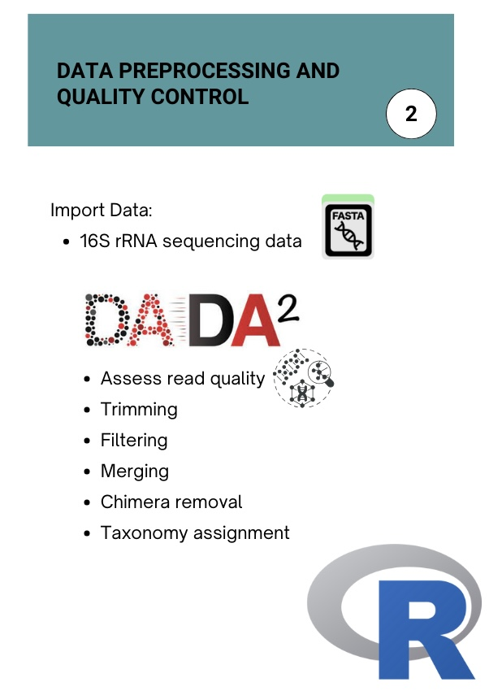
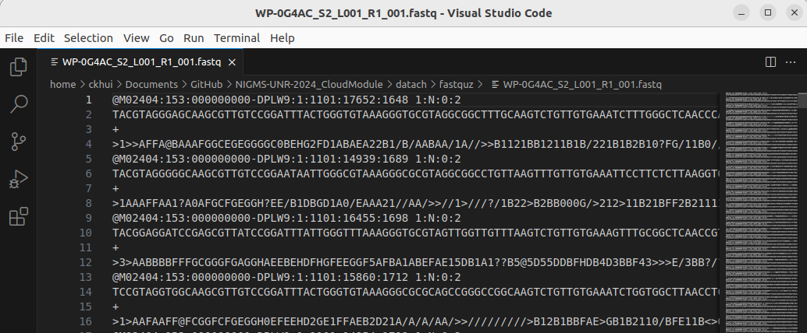
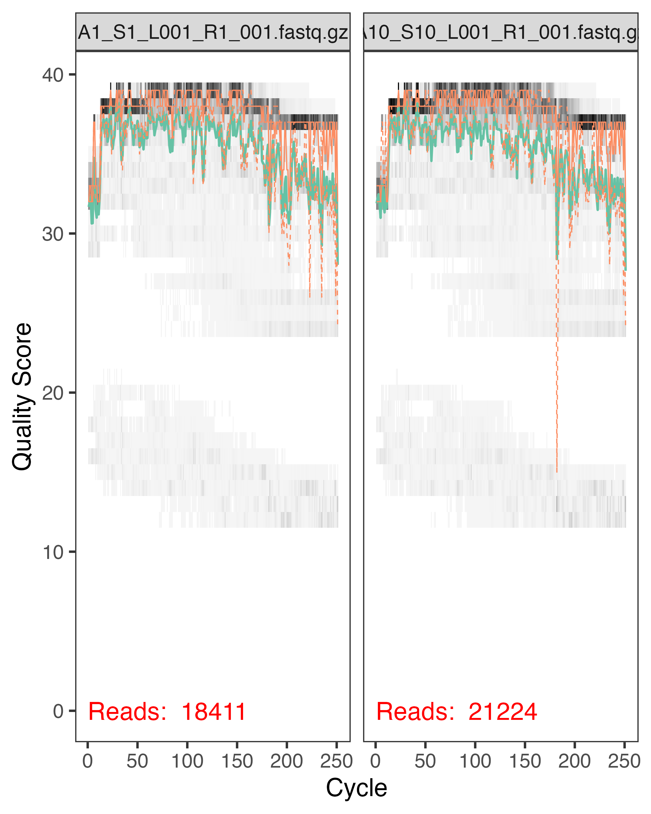
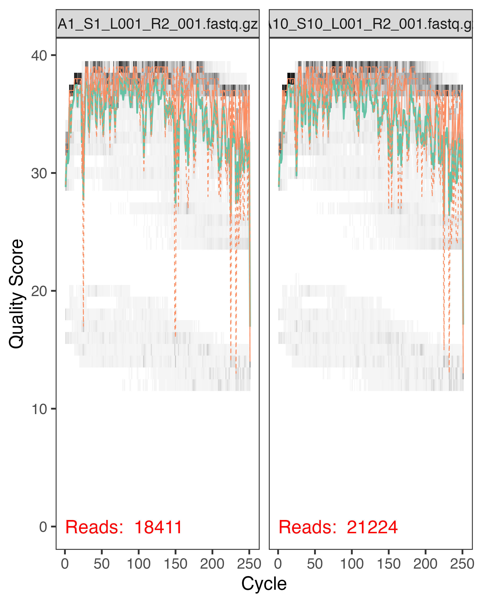

```{r setup, include=FALSE}
knitr::opts_chunk$set(echo = TRUE)
```

# Submodule 2: Data Preprocessing and Quality Control


## Overview
In this module, we’ll cover essential steps for preprocessing and quality control of 16S rRNA sequencing data. Effective data preprocessing ensures that our analyses are based on high-quality data, minimizing errors and maximizing accuracy. This module will guide you through importing raw sequencing data, performing quality filtering, and removing potential errors such as chimeric sequences.

We’ll explain the **FastQ** file formats and use **DADA2** for quality assessment and feature extraction. This hands-on practice will import and process real data from the Nevada Wolfpack Study which we will use in the next module for downstream analyses.

<center>
    
</center>

## Learning Objectives
+ Preprocess raw 16S rRNA sequencing data effectively.
+ Perform quality control checks on sequencing data.

## Import Sequencing Data

### Demultiplexing

Our starting point is demultiplexed samples sorted in individual files. Demultiplexing is a crucial step in processing high-throughput sequencing data when multiple samples are sequenced together in a single run (a process called multiplexing). Multiplexing allows researchers to save time and resources by sequencing multiple samples at once, but it introduces the need to sort, or "demultiplex," the data afterward.

$~$

In multiplexing, unique DNA "barcode" sequences are added to each sample before sequencing. During demultiplexing, these barcodes are used to identify which sequences belong to each original sample. The demultiplexing step occurs immediately after the sequencing machine outputs the raw data.

$~$

Demultiplexing software scans the data, recognizes the barcodes, and then separates sequences into individual files for each sample. Once demultiplexed, the data can be analyzed separately for each sample, moving on to further steps such as quality control, trimming, and chimera removal. Demultiplexing is typically performed by the sequencing platform's software and files of individual samples are given to the researcher. 

### Working with Our Samples

Working with microbiome data can be challenging. Traditional analysis methods cluster sequences based on similarity (operational taxonomic units (OTUs)), often missing the true biological diversity in the sample and sometimes lumping together different species. This can reduce the accuracy of the analysis, especially when studying complex microbial communities. Also, errors are often introduced during the sequencing process, such as substitutions (wrong bases) and chimera (sequences formed by two different DNA strands merging). These errors must be properly handled to avoid incorrect species identification. 

<center>
    
</center>

We will use [DADA2](https://benjjneb.github.io/dada2/tutorial_1_8.html) to load, process, and quality control our sequencing files. DADA2 is a widely used software package in bioinformatics for analyzing microbial communities from DNA sequencing data and handling errors. It works particularly well in processing 16S rRNA data. 

### How DADA2 Works

DADA2 takes a new approach by attempting to resolve individual sequences down to the level of single-nucleotide differences while correcting for sequencing errors<sup>1</sup>. This approach is called **Amplicon Sequence Variants (ASVs)**, which are highly accurate sequences that represent actual biological diversity in the sample without clustering.

$~$

The DADA2 workflow includes several key steps:

 <b>1. Inspecting Read Quality Profiles:</b> Before processing, DADA2 allows us to visualize the quality scores across all sequences. Quality scores provide an estimate of the accuracy of each base call in a sequence. By inspecting these scores, we can identify where the quality drops, which helps determine appropriate trimming parameters.
 
 <b>2. Filtering and Trimming:</b> Low-quality sequences and ambiguous bases can introduce errors in downstream analysis. In this step, we set quality thresholds to remove reads that don’t meet quality standards. Trimming removes low-quality ends of reads based on quality scores, helping to retain only high-quality sequences for further analysis.
 
 <b>3. Learning Error Rates:</b> DADA2 builds a model of the specific error rates associated with the sequencing run. Since error patterns vary between sequencing technologies and even between runs, DADA2 analyzes a subset of data to estimate these unique error rates. This error model helps DADA2 accurately correct errors in the sequencing reads.
 
 <b>4. Inferring Sample Composition (ASV Inference):</b> Using the error model, DADA2 corrects sequencing errors to identify unique, true biological sequences known as Amplicon Sequence Variants (ASVs). ASVs provide finer resolution than Operational Taxonomic Units (OTUs) and often represent exact biological sequences rather than clustered approximations.
 
 <b>5. Merging Paired Reads:</b> Since we are using paired-end sequencing, this step merges the forward and reverse reads that cover overlapping regions of the same DNA fragment. The merged reads typically provide higher accuracy by combining information from both ends, but reads that fail to overlap are discarded.
 
 <b>6. Constructing a Sequence Table:</b> After ASVs are identified, DADA2 constructs a sequence table, which is a matrix of samples and their ASV counts. This table serves as the primary data structure for downstream analysis, showing how many times each ASV appears in each sample.
 
 <b>7. Removing Chimeras:</b> Chimeric sequences are artifacts from PCR amplification, formed by combining segments from different DNA templates. DADA2 identifies these artificial sequences by comparing ASVs and removes them to reduce false positives in microbial identification.
 
 <b>8. Tracking Reads Through the Pipeline:</b> Throughout the pipeline, DADA2 tracks the number of reads retained at each step. This read-tracking helps to monitor data quality and determine where reads may have been lost, providing a quality control check on each processing stage.
 
 <b>9. Assigning Taxonomy:</b> After obtaining high-quality ASVs, DADA2 compares them to a reference database (e.g., SILVA, Greengenes) to assign taxonomic labels. This step allows us to identify the microbial taxa present in each sample down to species, genus, or other taxonomic levels, depending on the reference database used.

This process gives us highly accurate and reproducible results. We will start by installing and loading DADA2 and necessary packages.

$~$


```{r, eval=FALSE}
#Install the DADA2 and other packages
if (!requireNamespace("BiocManager", quietly = TRUE)) {
    install.packages("BiocManager")
}

if (!requireNamespace("dada2", quietly = TRUE)) {
    BiocManager::install("dada2")
}

if (!requireNamespace("devtools", quietly = TRUE)) {
    install.packages("devtools")
}

if (!requireNamespace("patchwork", quietly = TRUE)) {
    devtools::install("patchwork")
}
```

```{r, message=FALSE}
#Load the packages
library(dada2)
library(ggplot2)
library(patchwork)
```


Our sequencing files are stored in FASTQ format, a common file type for sequencing data. Each entry (or sequence) in a FASTQ file contains four lines: the sequence identifier, the DNA sequence, a separator, and a quality score line. This format is compact and efficient, making it essential for storing large-scale sequencing data.

$~$

<center>
    
</center>

$~$

FASTQ files follow the same format with each sequence entry:

 <b>1. Sequence Identifier:</b> Starts with an "@" symbol, followed by a unique identifier for the sequence. It may also contain additional details, such as the instrument used and the read number.
 
 <b>2. DNA Sequence:</b> The actual sequence of DNA bases (A, T, C, G) observed in the sample. The length of this line is equal to the number of bases sequenced.
 
 <b>3. Separator Line:</b> A "+" symbol acts as a separator between the sequence and its quality scores.
 
 <b>4. Quality Scores:</b> A string of characters representing the quality of each base in the sequence. Each character encodes a [Phred quality score](https://en.wikipedia.org/wiki/Phred_quality_score), where higher scores indicate more confidence in the accuracy of the base call. The quality string is the same length as the sequence line.
 
$~$

Now we will download our data and import it with DADA2.

$~$

```{r, eval = FALSE}
# Download data
system("wget -r -np -R 'index.html*' --no-check-certificate --cut-dirs=2 -nH https://biox.unr.edu/ftp/16S_Training_Module/")
```

```{r}
# Check files
path <- "fastqs"
list.files(path)
```


```{r}
# Forward and reverse fastq filenames have format: SAMPLENAME_L001_R1_001.fastq and SAMPLENAME_L001_R2_001.fastq
fnFs <- sort(list.files(path, pattern="_L001_R1_001.fastq", full.names = TRUE))
fnRs <- sort(list.files(path, pattern="_L001_R2_001.fastq", full.names = TRUE))
```


```{r}
# Extract sample names
sample.names <- sapply(strsplit(basename(fnFs), "_"), `[`, 1)
```

Check to make sure our sample names are correct.

$~$

```{r}
# Display sample names and number of samples
cat("Sample names:\n")
cat(sample.names, sep = "\n")
cat("There are", length(sample.names), "samples")
```

An `.rds` file saves R objects that can be quickly loaded back into R using `readRDS()`. While `.rds` files are optimized for R and can't be viewed directly outside of R, they are efficient for storing individual R objects and preserving their exact structure. This format is especially useful when you need to save and reload between sessions.

$~$

```{r}
# Save our data
saveRDS(sample.names, file = 'sampleNames.rds')
```

## 2. Data Preprocessing and Quality Control

### Read Quality Score
We will first look at the quality of the individual bases in the reads by pulling the Phred score for each read in a sample. The heatmap produced shows the frequency of each quality score at each base over all the reads for a given sample. The green line represents the median with orange lines representing quartiles. 

$~$

*Note:* Some of these steps take several minutes to run. 

$~$

```{r}
# View quality profiles of forward reads for the first 2 samples
plotQualityProfile(fnFs[1:2])
```

*This step will take several minutes to run.*

$~$

```{r}
# We can create a plot for all of the samples and
p1 = plotQualityProfile(fnFs) +
  ggtitle('Forward Reads')

p2 = plotQualityProfile(fnRs)+
  ggtitle('Reverse Reads')

```


```{r}
# Save the plot
ggsave('viz_data/plotQualityProfile.png', plot = p1 + p2, width = 18, height = 12, units = 'in', dpi = 600)
```

We can manually visualize our quality profiles for all of the samples (plotQualityProfile.png) in the viz_data folder. Quality scores typically decrease over sequencing cycles (positions along the read) due to several factors:

1. **Chemistry degradation**: As sequencing progresses, the chemistry becomes less efficient and error rates increase
2. **Signal interference**: Accumulation of incomplete washes, phasing/pre-phasing, and fluorescent noise
3. **Base calling uncertainty**: Higher error rates in later cycles make base calling less confident

$~$

```{r}
# View quality profiles of reverse reads for the first 2 samples
plotQualityProfile(fnRs[1:2])
```

Reverse reads typically show lower quality scores than forward reads. This is normal in paired-end sequencing data for several reasons:

  <b>1. Sequential Nature:</b> Reverse reads are generated after forward ones, when:
  
  - Reagents are more depleted
  - More sequencing cycles have occurred
  - More errors have accumulated

  <b>2. DADA2's Handling:</b> DADA2 is designed to work with this quality variation because:
  
   - It incorporates quality scores into its error models
   - It can differentiate between sequencing errors and real biological variation
   - Each base is weighted by its quality score in the algorithm

  <b>3. Trimming Strategy:</b> While DADA2 can handle lower quality scores, we still trim the poorest quality bases because:
  
   - It improves the algorithm's performance
   - Reduces computational time
   - Increases confidence in the final results
   - Helps remove technical artifacts


<br>

### Understanding Our Sequencing Run Quality

Due to a recent system update on the MiSeq, the sequencing run was inadvertently over-clustered, producing an excess of low-quality reads we see in the plots. Let's break down what happened and why it matters:
 
#### What is Over-Clustering?
During DNA sequencing, molecules attach to the flow cell surface in spots called "clusters". Think of it like planting seeds in a garden:
- Optimal spacing: Each plant has room to grow and be identified clearly
- Over-crowded: Plants grow too close, making it hard to tell them apart
 
#### What Happened in Our Run?
A MiSeq system update led to over-clustering, meaning:
- Too many DNA clusters formed on the flow cell
- Clusters grew too close together
- Their signals interfered with each other
- Like trying to read many overlapping words
 
#### Impact on Our Data
1. **Initial Data:**
   - High number of raw reads
   - But many reads have poor quality scores
  
2. **After Quality Filtering:**
   - Significant reduction in read count
   - Remaining reads are high quality
   - More trustworthy for analysis
 
This is okay for our analysis because quality is more important than quantity, removing unreliable data improves our final results, and we still have sufficient good quality reads for analysis.


### Here is an example of good quality reads: 
High-quality reads typically have consistent Phred scores across their length, with minimal drop-off at the ends.







### Filter and Trim


```{r}
# Place filtered files in filtered/ subdirectory
filtFs <- file.path(path, "filtered", paste0(sample.names, "_F_filt.fastq.gz"))
filtRs <- file.path(path, "filtered", paste0(sample.names, "_R_filt.fastq.gz"))
names(filtFs) <- names(filtRs) <- sample.names
```


DADA2's `filterAndTrim()` function processes raw sequencing reads to ensure high-quality data for analysis. Here's a explanation of each parameter:

#### Key Parameters for V4 16S rRNA Data:

`truncLen=c(200,130)`: Truncating read length

 - For V4 region (~250 bp), we expect ~200-250 bp reads
 - Forward reads (R1) at 200 bp because quality usually stays good
 - Reverse reads (R2) truncated more aggressively at 130 bp due to quality drop
 - These numbers are chosen by examining quality plots for your specific run
 - Must ensure enough overlap between F and R reads (~20 bp minimum)

##### Quality Control Parameters:

`maxEE=c(2,5)`: Maximum "expected errors" allowed

 - More stringent for forward reads (2 errors)
 - More lenient for reverse reads (5 errors)
 - Higher numbers = more lenient filtering

`truncQ=2`: Cuts reads when quality score drops to Q2

 - Removes poor quality ends dynamically
 - Q2 is very low quality, ensures removal of worst bases

##### Technical Parameters:

- `maxN=0`: Removes reads with any ambiguous bases (N)
- `trimLeft=c(0,0)`: No trimming from read starts
- `rm.phix=TRUE`: Removes PhiX spike-in control DNA (if you are using those)

#### How to Choose Parameters:

1. Check quality plots first
2. Look for where quality drops significantly
3. Ensure enough overlap remains for merging
4. Consider your downstream analysis needs
5. Balance stringency with maintaining sufficient read depth

```{r}
# Set trimming standards first
out <- filterAndTrim(fnFs, filtFs, fnRs, filtRs, truncLen=c(200,130),
                     maxN=0, maxEE=c(2,5), trimLeft = c(0,0), truncQ=2, rm.phix=TRUE,
                     compress=TRUE, multithread=TRUE) 

```


```{r}
# View outputs
head(out)
```


### Learn the Error Rates

While quality scores tell us about the confidence in each base call, DADA2 goes further by learning the specific error patterns in your dataset. Here's how it works:

#### Quality Scores vs. Error Models
- **Quality scores** are like confidence ratings for each base
  - Assigned during sequencing
  - Based on how clear the signal was
  - Same score means same confidence across any run

- **DADA2's error models** are like fingerprints of your specific run
  - Learns what errors look like in your data
  - Accounts for systematic patterns specific to your run
  - Different for every dataset

#### How DADA2 Learns
1. First looks at your sequences and their frequencies
2. Makes initial guesses about which sequences are real vs. errors
3. Keeps refining these guesses as it processes more data
4. Creates a customized error profile for your specific dataset

Think of it like this: Quality scores are like spell-checking individual words, while DADA2's error model is like learning someone's specific typing patterns to better catch their common mistakes.

$~$

*Note: This is why DADA2 is more sophisticated than simple quality filtering - it understands the unique "personality" of your sequencing run's errors.*

$~$

*These steps will take several minutes to run.*

$~$

```{r}
# Error model for forward reads
errF <- learnErrors(filtFs, multithread=TRUE)
```


```{r}
# Error model for reverse reads
errR <- learnErrors(filtRs, multithread=TRUE)
```


```{r}
# Save our outputs
saveRDS(errF,file="errF.rds")
saveRDS(errR,file="errR.rds")
```

$~$

<details>
<summary>If you are coming back to this module, reload your saved data here.</summary>
<br>
If you are coming back to this module, you can load your saved data instead of rerunning. Use the following R code to upload saved data.
    
```{r}
errF <- readRDS("errF.rds")
errR <- readRDS("errR.rds")

```
</details>

$~$

We can now plot the estimated error rates. These plots displays the observed error rates across various quality scores for each base position in the reads (A, C, G, T). It allows us to compare the empirical error rates (from the actual data) to the estimated error rates (based on the model DADA2 has learned represented in a black line).

$~$

```{r}
# Plot forward reads estimated error rates
plotErrors(errF, nominalQ=TRUE) +
  ggtitle('errF')
```


```{r}
# Plot reverse reads estimated error rates
plotErrors(errR, nominalQ = TRUE) +
  ggtitle('errR')
```


### Sample Inference

We will now use DADA2's learned error rates and identify amplicon sequence variants (ASV) while removing likely errors. 

$~$

*This step will take several minutes to run.*

$~$

```{r}
# Creating DADA object
dadaFs <- dada(filtFs, err=errF, multithread=TRUE) # filtered reads in unique sequences
dadaRs <- dada(filtRs, err=errR, multithread=TRUE)
```


```{r}
# Review DADA object
dadaFs[[1]]
```


### Merging Paired Reads

Our data is paired-end sequencing, DNA fragments are sequenced from both ends - the forward read (5' end) and reverse read (3' end) of the template strand. This approach provides higher quality data than single-end sequencing because the overlapping regions between reads allow for error validation and longer final sequences. DADA2 merges these paired reads by identifying matching overlap regions and combining them into single, high-confidence sequences, discarding any pairs that don't align properly.

$~$

The `mergePairs()` funcation requires the dada objects we created as well as the filtered reads, because not all of that information is stored in the dada objects we created in the last step. 

$~$

```{r, message=FALSE}
# Combine the forward and reverse reads into one
mergers <- mergePairs(dadaFs, filtFs, dadaRs, filtRs, verbose=TRUE)
# Inspect the merger data.frame from the first sample
head(mergers[[1]])
```

### Construct sequence table

We can now constuct the ASV table. This table is a matrix of samples (rows) and each ASV identified (columns). 

$~$

```{r}
# View the dimensions of our merged samples 
seqtab  <- makeSequenceTable(mergers)
dim(seqtab)
```

Our table contains 35 samples and 5902 ASVs. Now let's view the lengths of the variants. 

$~$

```{r}
# Inspect the distribution of sequence lengths
table(nchar(getSequences(seqtab))) # the length should be around 250
```


### Remove Chimeras

DADA2's error model corrects for substitutions and indels, but not Chimeras (two different DNA strands megred together). Chimeras are easier to identify in ASVs, as opposed to OTUs, because of their exact sequences.

$~$

```{r}
# Remove chimeras
seqtab.nochim <- removeBimeraDenovo(seqtab, method="consensus", multithread=TRUE, verbose=TRUE)
```

*Note: DADA2 uses the term "bimera" specifically because it refers to sequences formed from exactly two parent sequences, "bi-" meaning two. While "chimera" is the broader term that can include sequences formed from multiple parent sequences (three or more), most artificial chimeric sequences in amplicon sequencing are actually bimeras. DADA2's algorithm specifically looks for these two-parent artifacts as they are the most common type of chimeric sequence formed during PCR amplification.*

$~$

```{r}
# New sequence table
dim(seqtab.nochim)
# Divide the new number of ASVs by the first table.
# This shows us what percentage was removed
sum(seqtab.nochim)/sum(seqtab)
```

Here we can see that Chimeras accounted for ~10% of the merged sequence reads.

$~$

```{r}
# Save our data
saveRDS(seqtab.nochim, "seqtabnochim.rds")
```

### Track reads through the pipeline

Let's construct a summary table of our steps to see how many reads were removed in the cleaning process. 

$~$

```{r}
getN <- function(x) sum(getUniques(x))
track <- cbind(out, sapply(dadaFs, getN), sapply(dadaRs, getN), sapply(mergers, getN), rowSums(seqtab.nochim),
               final_perc_reads_retained=round(rowSums(seqtab.nochim)/out[,1]*100, 1))
# formatting table before writing to file
colnames(track) <- c("input", "filtered", "denoisedF", "denoisedR", "merged", "nonchim","percent")
rownames(track) <- sample.names
track
write.table(track, "read-count-tracking.txt", quote=FALSE, sep="\t")
```

We retained ~25-30% of our original reads! This is likely due to the poor quality we saw at the beginning. Although we now have much less data to work with, it is high quality. 

### Read in taxonomy

The last step in this model is to read in a taxonomy database. We must first select a database. Two of the most commonly used are Greengenes and SILVA, each with its strengths and weaknesses.

$~$
 
 + Greengenes<sup>2</sup> is a chimera-checked 16S rRNA gene database. It provides chimera screening, standard alignment, and taxonomic classification using multiple published taxonomies. Its most recent update was on July 03, 2017.

 + [SILVA](https://www.arb-silva.de/documentation/release-138.1/)<sup>3-4</sup> is a high quality ribosomal RNA database. It is a comprehensive and quality-controlled database for up-to-date ribosomal RNA sequences. Additionally, SILVA also provides many other tools like alignment, phylogenetic tree classification, and probe/primer matching. It was last updated on August 27, 2020.
 
$~$

Since our data has chimeras removed and we want the most up-to-date analysis, we will use SILVA.

$~$

*This step will take several minutes to run.*

$~$

```{r}
# Read in Taxonomy
taxa <- assignTaxonomy(seqtab.nochim, "tax/silva_nr99_v138.1_train_set.fa.gz", multithread=TRUE)
taxa <- addSpecies(taxa, "tax/silva_species_assignment_v138.1.fa.gz")
```

```{r}
# Let's take a look
taxa.print <- taxa # Removing sequence row names for display only
rownames(taxa.print) <- NULL
head(taxa.print)
```

#### Adding Controls

Microbime studies often include mock and/or blank controls to help identify and mitigate possible contamination, ensuring the accuracy and reliability of the data.

$~$

 + **Mock Controls:** These are samples with a known microbial community composition, often with a defined mix of microbial strains in known proportions. By including mock controls, researchers can verify the performance of the sequencing pipeline and taxonomic assignment tools. If the analysis accurately identifies the species and proportions in the mock community, it provides confidence that the methods are performing correctly. Any discrepancies may indicate biases in the sequencing or analysis process that should be addressed.
 + **Blank Controls:** These are negative controls that contain no added DNA. Blank controls help detect potential contamination from reagents, the lab environment, or equipment. Since microbial DNA is often present at very low concentrations, contamination can skew results, especially for low-biomass samples. If microbial sequences appear in blank controls, it could indicate contamination, and researchers can account for this by removing these sequences from experimental samples.

Although our study does not have these controls, incorporating both mock and blank controls in the study design can boost quality control. It helps distinguish true biological signals from artifacts introduced during sample processing or sequencing. 


$~$

```{r}
# Save our data
saveRDS(taxa, "taxa.rds")
```


## Quiz

```{r, warning=FALSE}
# Run the following command to take the quiz
library(htmltools)
includeHTML("questions/Quiz_Submodule2.html")
```

## Conclusion
In this module, we took a comprehensive journey from the initial stages of data acquisition through taxonomic assignment. We began by downloading and exploring the survey data to understand the metadata associated with each sample. Following this, we downloaded the raw sequencing FASTQ files and preprocessed them using the DADA2 pipeline, which allowed us to perform quality control, error correction, and sequence denoising, resulting in high-quality amplicon sequence variants (ASVs). Finally, we assigned taxonomy to the ASVs using a reference database, enabling us to identify and categorize the microbial communities present in our samples. This workflow provides a foundational dataset ready for downstream analysis, such as community composition comparisons and diversity assessments in the next module.


## References

1. Callahan BJ, McMurdie PJ, Rosen MJ, Han AW, Johnson AJA, Holmes SP. 2016. DADA2: High-resolution sample inference from Illumina amplicon data. Nat Methods 13:581–583. doi:10.1038/nmeth.3869
2. DeSantis TZ, Hugenholtz P, Larsen N, Rojas M, Brodie EL, Keller K, Huber T, Dalevi D, Hu P, Andersen GL. Greengenes, a chimera-checked 16S rRNA gene database and workbench compatible with ARB. Appl Environ Microbiol. 2006 Jul;72(7):5069-72. doi: 10.1128/AEM.03006-05. PMID: 16820507; PMCID: PMC1489311.
3. Quast C, Pruesse E, Yilmaz P, Gerken J, Schweer T, Yarza P, Peplies J, Glöckner FO (2013) The SILVA ribosomal RNA gene database project: improved data processing and web-based tools. Nucl. Acids Res. 41 (D1): D590-D596.
4. Yilmaz P, Parfrey LW, Yarza P, Gerken J, Pruesse E, Quast C, Schweer T, Peplies J, Ludwig W, Glöckner FO (2014) The SILVA and "All-species Living Tree Project (LTP)" taxonomic frameworks. Nucl. Acids Res. 42:D643-D648

